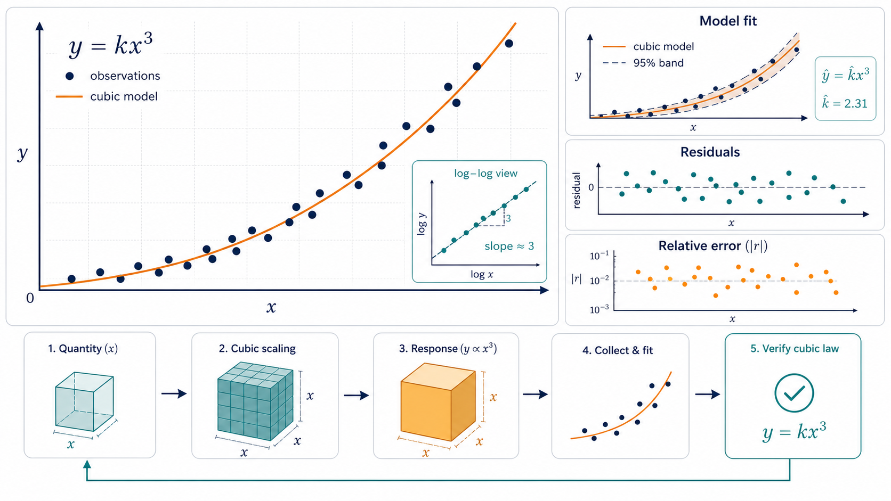

# Cubic Law

    

  <strong>Notebook experiments for cubic-law behavior and empirical scaling checks.</strong>

  

The overview figure shows the notebook workflow: define assumptions, run controlled experiments, compare fitted scaling curves, and keep the resulting diagnostics close to the analysis.

## Overview

Cubic Law is a compact research notebook for testing cubic-law relationships, inspecting scaling behavior, and recording the empirical plots that support the analysis. The repository is intentionally small so the main notebook remains the source of truth.

## What Is Included

- `cubic_law.ipynb`: primary notebook for derivations, experiments, and plots.
- `README.md`: project landing page and usage notes.

## Quick Start

1. `git clone git@github.com:Hik289/cubic_law.git`
2. `python -m venv .venv && source .venv/bin/activate`
3. `python -m pip install -U pip jupyter numpy scipy matplotlib pandas`
4. `jupyter notebook cubic_law.ipynb`

## Suggested Workflow

1. Start with the smallest runnable script or notebook listed above.
2. Keep raw data paths and credentials outside the repository.
3. Save generated figures, tables, and reports under the existing result folders.
4. When an experiment becomes stable, record the exact data window, parameters, and command used to reproduce it.

## Repository Map

- `assets/readme-figure.png`: README overview figure.
- Project scripts and notebooks: core research entry points.
- Result or report folders: generated artifacts used for analysis and review.

## Paper or Reference

No external paper link is currently attached to this project. For now, the code, notebooks, and notes in this repository are the primary reference artifact.

## License

No explicit license file is included yet. Add one before public reuse, redistribution, or package release.

## Maintenance Notes

- Add a pinned environment file if this project is prepared for external installation.
- Keep large datasets outside Git and document where each script expects them locally.
- Prefer small, named experiment outputs over overwriting shared result files.
